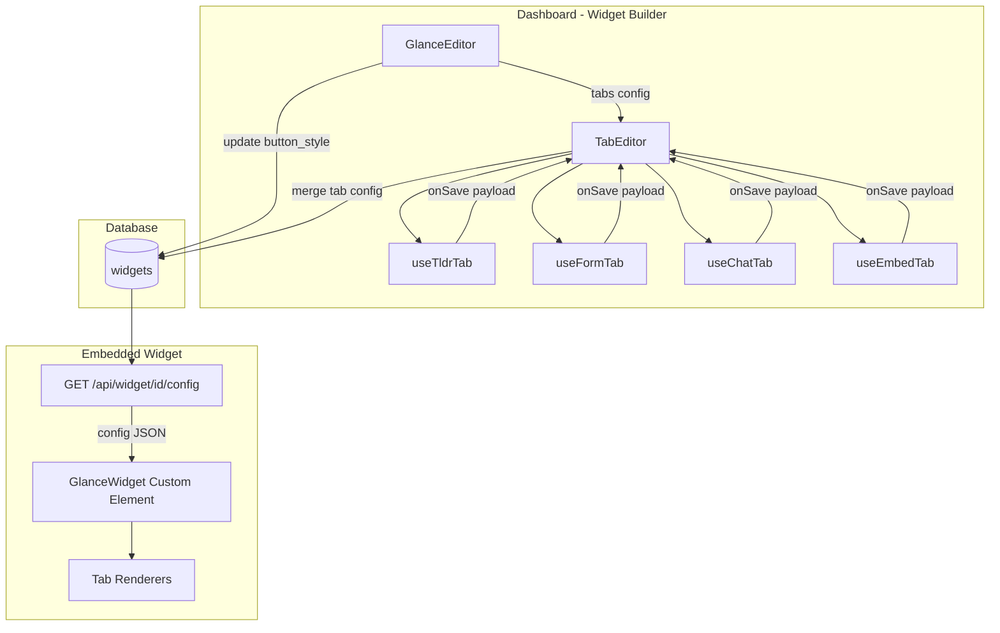

# Glance: Widget Builder — Implementation Guide

How Glance's widget builder works: building a widget with different tab types, each with its own settings, plus widget-level customization. Optimized for **one widget per account** — no workspaces or multiple glances.

---

## Table of Contents

1. [Architecture Overview](#1-architecture-overview)
2. [Data Model](#2-data-model)
3. [Widget-Level Configuration](#3-widget-level-configuration)
4. [Tab Types & Config Schemas](#4-tab-types--config-schemas)
5. [Tab Editor Pattern](#5-tab-editor-pattern)
6. [Widget Config API](#6-widget-config-api)
7. [Client-Side Widget](#7-client-side-widget)
8. [Key Files Reference](#8-key-files-reference)
9. [Replication Checklist (One Widget per Account)](#9-replication-checklist-one-widget-per-account)

---

## 1. Architecture Overview



**Flow:**

1. **GlanceEditor** — Main widget builder UI. Manages name, logo, theme color, tabs list (names, icons, types), floating prompts, and callout button.
2. **TabEditor** — Per-tab settings. Renders the appropriate editor (TLDR, Form, Chat, Embed) based on tab type. Each editor uses a hook that returns `editorSections`, `preview`, `hasChanges`, `handleSave`.
3. **Save** — Tab editor calls `onSave(payload)`; TabEditor merges `payload` into `tabs[tabIndex]` and updates `widgets.button_style` in the database.
4. **Widget** — Fetches config from `GET /api/widget/{id}/config`, receives `tabs` + `theme_color` + etc., and renders the appropriate content per tab type.

---

## 2. Data Model

### One Widget per Account

For a new product with one widget per account:

```sql
-- Single widget per account (or user)
create table widgets (
  id uuid primary key default gen_random_uuid(),
  account_id uuid references accounts(id) on delete cascade,  -- or user_id
  name text not null,
  logo_url text,
  theme_color text default '#7C3AED',
  button_style jsonb default '{}',
  hash_prefix text default 'glance',
  is_active boolean default true,
  created_at timestamptz default now(),
  updated_at timestamptz default now()
);

-- Ensure one widget per account
create unique index idx_widgets_one_per_account on widgets(account_id);
```

Glance uses `workspace_id` and allows multiple widgets; for your product, use `account_id` (or `user_id`) and enforce a single widget per account.

### Core Storage: `button_style` JSONB

All configurable widget content lives in `button_style`:

| Key | Type | Description |
|-----|------|-------------|
| `tabs` | `TabConfig[]` | Array of tab configs (up to 5 in Glance) |
| `prompts` | `{ text: string; link: string }[]` | Floating suggested prompts (e.g. 3) |
| `callout_text` | string | Main button label (e.g. "Find the right investor") |
| `callout_url` | string | Hash or tab link the main button opens |

Everything else (name, logo_url, theme_color) is stored at the widget row level.

---

## 3. Widget-Level Configuration

### GlanceEditor Manages

| Setting | Storage | Description |
|---------|---------|-------------|
| Name | `widgets.name` | Widget / brand name |
| Logo | `widgets.logo_url` | Logo image URL (upload to storage) |
| Theme color | `widgets.theme_color` | Hex accent color (e.g. `#7C3AED`) |
| Widget icon | `widgets.logo_url` (or separate) | Icon for launcher button |
| Tabs | `button_style.tabs` | Array of tab objects |
| Callout text | `button_style.callout_text` | Main CTA button label |
| Callout URL | `button_style.callout_url` | Where callout links (e.g. `#glance-chat`) |
| Prompts | `button_style.prompts` | Floating prompt pills `{ text, link }` |

### Tab List Structure

Each entry in `tabs` has base fields plus type-specific fields:

```typescript
interface TabBase {
  name: string        // "About", "AI Chat", "Contact"
  icon: string       // URL or path to tab icon
  type: string       // "TLDR" | "AI Chat" | "Content" | "Form" | "Tally" | "Spotify" | ...
  hash_trigger?: string   // for deep linking, e.g. "about"
  is_premium?: boolean    // gated by auth
}
// Plus type-specific fields merged into the same object
```

### Tab Management UX

- **Up to 5 tabs** (configurable)
- **Drag-and-drop** to reorder
- **Type picker** — modal to select tab type (TLDR, AI Chat, Content, Form, Gallery, Poll, Tally, Spotify, etc.)
- **Drop zone** — drag tab to "clear" resets name/icon/type
- **Configure** — link to `/tab/{index}` for per-tab settings

---

## 4. Tab Types & Config Schemas

### 4.1 TLDR / Content / Static Content

About/landing tab. Shared schema; "Content" and "Static Content" are aliases.

| Field | Type | Description |
|-------|------|-------------|
| `tldr_title` | string | Heading |
| `tldr_subtitle` | string | Subheading |
| `tldr_banner_url` | string | Banner image URL |
| `tldr_banner_aspect_ratio` | string | e.g. "16:9", "2:1" |
| `tldr_logo_url` | string | Logo in header |
| `tldr_socials` | `{ platform, url }[]` | LinkedIn, X, YouTube, Facebook, Instagram, TikTok |
| `tldr_content_links` | `ContentLink[]` | Repeatable content blocks |

**ContentLink** (each content block):

| Field | Type | Description |
|-------|------|-------------|
| `content_type` | `'row' \| 'stack' \| 'quote' \| 'photo' \| 'video'` | Block type |
| `title` | string | Block title |
| `description` | string | Block description |
| `link` | string | External URL |
| `tabLink` | string | Internal tab (e.g. "#Contact") |
| `imageUrl` | string | For row/photo |
| `quoteText`, `quoteName`, `quoteTitle` | string | For quote blocks |
| `videoUrl` | string | For video blocks |
| `card_background_style` | `'white' \| 'theme' \| 'black'` | Card styling |

### 4.2 AI Chat

| Field | Type | Description |
|-------|------|-------------|
| `welcome_message` | string | First bot message |
| `directive` | string | Rich text (HTML) — system instructions |
| `failure_message` | string | When AI has no answer |
| `suggested_prompts` | string[] | Up to 5 prompt pills in chat |
| `knowledge_sources` | string[] | UUIDs of knowledge_sources to search |

### 4.3 Form

| Field | Type | Description |
|-------|------|-------------|
| `tldr_title` | string | Form title |
| `tldr_subtitle` | string | Form subtitle |
| `tldr_banner_url` | string | Optional banner |
| `tldr_banner_aspect_ratio` | string | Banner aspect |
| `form_fields` | `{ label: string; type: string }[]` | Field definitions |
| `form_webhook_url` | string | Optional webhook on submit |
| `form_success_message` | string | Post-submit message |

**Form field types:** `Text Field`, `Text Area`, `Email`, `Phone Number`, `Link / URL`, `File Upload`, `Checkbox(es)`.

### 4.4 Tally / Spotify (Embed)

Third-party iframe embeds. URL is transformed to embed format.

| Field | Type | Description |
|-------|------|-------------|
| `original_url` | string | User pastes Tally or Spotify URL |
| `embed_url` | string | Computed embed URL (saved on save) |

**Tally:** `tally.so/r/{id}` → `tally.so/embed/{id}?hideTitle=1`  
**Spotify:** `open.spotify.com/playlist/{id}` → `open.spotify.com/embed/playlist/{id}`

### 4.5 Gallery, Poll

Glance includes Gallery and Poll in the type picker. Their schemas follow similar patterns (items array, config fields). Omit or simplify if not needed for your product.

---

## 5. Tab Editor Pattern

### Orchestrator: TabEditor

TabEditor is the single page for configuring a tab. It:

1. Loads `glance` (widget) and `tabs = glance.button_style.tabs`
2. Gets `tab = tabs[tabIndex]` and determines type
3. Renders the appropriate hook: `useTldrTab`, `useFormTab`, `useChatTab`, `useEmbedTab`
4. Provides `onSave` that merges the payload into `tabs[tabIndex]` and updates the widget

```typescript
// TabEditor.tsx — simplified
const onSave = async (tabPayload: Record<string, any>) => {
  const updatedTabs = [...tabs]
  updatedTabs[tabIndex] = {
    ...updatedTabs[tabIndex],
    hash_trigger: hashTrigger.trim() || autoHash,
    is_premium: isPremium,
    ...tabPayload,
  }
  await supabase
    .from('widgets')
    .update({
      button_style: {
        ...currentButtonStyle,
        tabs: updatedTabs,
      },
    })
    .eq('id', glanceId)
}
```

### Tab Hook Interface

Each tab type implements the same interface:

```typescript
interface TabHookProps {
  tab: any
  glanceId: string
  tabIndex: number
  glanceName: string
  themeColor: string
  tabs: any[]
  onSave: (payload: Record<string, any>) => Promise<void>
  saving: boolean
  // Optional: workspaceId, isPremium, knowledgeSources (for Chat)
}

interface TabHookResult {
  editorSections: React.ReactNode   // Left panel: form fields
  preview: React.ReactNode          // Right panel: live preview
  hasChanges: boolean
  handleSave: () => Promise<void>
}
```

### Hook Implementation Pattern

```typescript
export function useTldrTab({ tab, onSave, ... }: TabHookProps): TabHookResult {
  const savedTitle = (tab as any).tldr_title ?? ''
  const [title, setTitle] = useState(savedTitle)
  // ... more state

  const hasChanges = title !== savedTitle || ...

  const handleSave = async () => {
    await onSave({
      tldr_title: title,
      tldr_subtitle: subtitle,
      tldr_banner_url: bannerUrl,
      tldr_content_links: contentLinks,
      // ... all fields for this type
    })
  }

  const editorSections = (/* form JSX */)
  const preview = (/* preview JSX */)

  return { editorSections, preview, hasChanges, handleSave }
}
```

### Type Detection

TabEditor picks the hook by `tab.type`:

```typescript
const isTldrTab = tabType === 'TLDR' || tabType === 'Content' || tabType === 'Static Content'
const isFormTab = tabType === 'Form'
const isChatTab = tabType === 'AI Chat'
const isEmbedTab = tabType === 'Tally' || tabType === 'Spotify'

const activeTab = isChatTab ? chatTab : isFormTab ? formTab : isEmbedTab ? embedTab : tldrTab
```

---

## 6. Widget Config API

### GET /api/widget/{id}/config

Public endpoint (no auth). Returns the config the embedded widget needs.

**Response:**
```json
{
  "id": "uuid",
  "name": "My Widget",
  "logo_url": "https://...",
  "theme_color": "#7C3AED",
  "tabs": [
    {
      "name": "About",
      "icon": "/images/icon.svg",
      "type": "TLDR",
      "hash_trigger": "about",
      "tldr_title": "Welcome",
      "tldr_subtitle": "Learn more",
      "tldr_banner_url": "...",
      "tldr_content_links": [...]
    },
    {
      "name": "AI Chat",
      "icon": "/images/Chats.svg",
      "type": "AI Chat",
      "hash_trigger": "chat",
      "welcome_message": "Hi! How can I help?",
      "knowledge_sources": ["uuid1", "uuid2"],
      "suggested_prompts": ["Find investors", "..."],
      "directive": "...",
      "failure_message": "..."
    }
  ],
  "prompts": [
    { "text": "Find the right investor", "link": "#glance-chat" }
  ],
  "callout_text": "Find the right investor",
  "callout_url": "#glance-chat",
  "auth": { /* if using premium tabs */ }
}
```

**Filtering:** Only include tabs with both `name` and `type` set. Empty or unconfigured tabs are omitted.

---

## 7. Client-Side Widget

### Embed Code

```html
<script src="https://yourdomain.com/widget.js" data-widget-id="xxx"></script>
```

### Initialization

1. Script reads `data-widget-id` from its tag
2. Fetches `GET /api/widget/{id}/config`
3. Creates custom element (e.g. `<glance-widget>`) with Shadow DOM
4. Injects theme: `host.style.setProperty('--vcs-purple', config.theme_color)`
5. Renders button row + tab content based on `config.tabs`

### Structure

- **Button row** — main CTA (callout_text) + logo button
- **Floating prompts** — optional pills from `config.prompts` that open widget to linked tab
- **Panel** — scrollable content area + tab nav bar
- **Tab renderers** — switch on `tab.type` to render TLDR, Chat, Form, Embed, etc.

### Deep Linking

- Hash format: `#glance-{hash_trigger}` (or custom prefix)
- On load / hash change: open widget and switch to matching tab
- `hash_trigger` comes from tab config (e.g. "about" → `#glance-about`)

---

## 8. Key Files Reference

| File | Purpose |
|------|---------|
| `apps/dashboard/src/app/glances/[id]/GlanceEditor.tsx` | Widget builder: name, logo, theme, tabs list, prompts, callout |
| `apps/dashboard/src/app/glances/[id]/tab/[tabIndex]/TabEditor.tsx` | Tab orchestrator: routes to type-specific editor, provides onSave |
| `apps/dashboard/src/app/glances/[id]/tab/[tabIndex]/TldrTabEditor.tsx` | TLDR/Content tab: banner, logo, socials, content links |
| `apps/dashboard/src/app/glances/[id]/tab/[tabIndex]/FormTabEditor.tsx` | Form tab: fields, webhook, success message |
| `apps/dashboard/src/app/glances/[id]/tab/[tabIndex]/ChatTabEditor.tsx` | AI Chat tab: directive, knowledge sources, prompts |
| `apps/dashboard/src/app/glances/[id]/tab/[tabIndex]/EmbedTabEditor.tsx` | Tally/Spotify: URL input, embed URL derivation |
| `apps/dashboard/src/app/glances/[id]/tab/[tabIndex]/shared/icons.tsx` | TabHookProps, TabHookResult, shared icons |
| `apps/dashboard/src/app/api/widget/[id]/config/route.ts` | Public config API |
| `apps/dashboard/public/widget.js` | Embedded widget (vanilla JS, Shadow DOM) |

---

## 9. Replication Checklist (One Widget per Account)

To integrate this widget builder into a new product with **one widget per account**:

1. **Database**
   - `widgets` table with `account_id` (or `user_id`)
   - Unique constraint: one widget per account
   - Columns: `id`, `account_id`, `name`, `logo_url`, `theme_color`, `button_style` (jsonb), `is_active`

2. **Widget Builder UI**
   - Single-page editor (no widget list when one per account)
   - Sections: Name & Logo, Theme Color, Tabs (add/reorder/type), Prompts, Callout
   - Route: `/widget` or `/settings/widget` instead of `/glances/[id]`

3. **Tab Editor**
   - Route: `/widget/tab/[tabIndex]` or `/settings/widget/tab/[tabIndex]`
   - TabEditor loads the single widget, passes `tabs[tabIndex]` to the type hook
   - Reuse TabHookProps / TabHookResult pattern

4. **Tab Types**
   - Start with: TLDR, AI Chat, Form, Embed (Tally/Spotify)
   - Add Gallery, Poll, etc. if needed
   - Each type: dedicated hook + schema

5. **Config API**
   - `GET /api/widget/config` — for one-widget products, can use `?account_id=xxx` or derive from session
   - Or `GET /api/widget/[id]/config` if you keep widget IDs

6. **Embed Script**
   - `data-widget-id` or `data-account-id` depending on your model
   - Fetch config, render custom element with Shadow DOM

7. **File Uploads**
   - Logo, tab icons, banners: upload to storage (e.g. Supabase Storage), store URLs in config

8. **Skip**
   - Workspaces, multiple glances/widgets, sidebar with widget list
   - Simplify nav to: Widget Settings, Tab 1…Tab N
